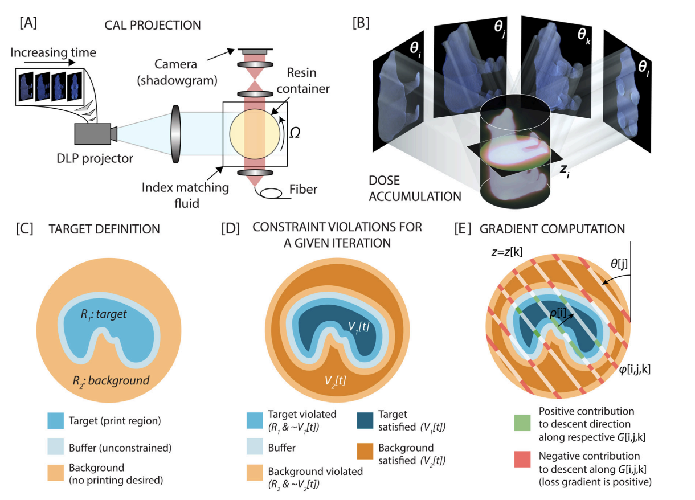

# High fidelity tomographic 3D printing
## Iterative projection calculation: forward model

This python implementation provides the optimization and projection generation framework used for volumetric additive manufacturing as described in the following publications:

[1] B. E. Kelly, I. Bhattacharya, H. Heidari, M. Shusteff, C. Spadaccini, H. K. Taylor, "Volumetric additive manufacturing via tomographic reconstruction", *Science*, 363 (6431), 1075-1079, 2019

[2] I. Bhattacharya, J. Toombs, H. K. Taylor, "High fidelity volumetric additive manufacturing", *Additive Manufacturing*, 47, 102299, 2021

[3] I. Bhattacharya, B. Kelly, M. Shusteff, C. Spadaccini, H. K. Taylor, "Computed axial lithography: volumetric 3D printing of arbitrary geometries", SPIE COSI, 2018

In computed axial lithography, a carefully calculated video is projected into a steadily rotating photocurable resin. The video is synchronized to the rotation of the resin so that specific images are projected at each rotated angle. This is modeled as an integral projection of the image through the resin container (in the low attenuation case). The accumulation of dose leads to a two step printing process. The first step, which consumes most of the dose is an induction phase where oxygen free radicals are neutralized by polymer free radicals. The second step is gelation where the excess polymer free radicals cross-link and solidify into a desired geometry. A detailed discussion and process model are provided in [1] and [2] above, but briefly, the forward model can be described as follows:

The 3D dose distribution within the photosensitive resin $f(\mathbf{r}, z)$ (Joules/cm3) arising from a set of projections $g(\rho, \theta, z)$ (Watt/cm2) can be expressed using the integral projection operation as:

$$ f(\mathbf{r}, z) = \frac{\alpha N_r}{\Omega} \int_{\theta = 0} ^{2\pi} g(\rho = \mathbf{r}.\hat{\theta}, \theta, z) e^{-\alpha \mathbf{r}. \hat{\theta}_\perp} d\theta $$

where $N_r$ denotes an integer number of rotations, $\alpha$ is the attenuation per unit length according to the Beer-Lambert law and $\Omega$ is the angular velocity of rotation of the resin container. Note that the expression excluding the pre-factor is the adjoint of the exponential radon tranform.

We are interested in achieving solidification in a region $R_1$ and no solidification in a subset of its compliment with respect to the region volume (which we denote as $R_2$). The dose requirement may be expressed in a simplified form as:

$$ R_1: f(\mathbf{r}, z) \ge d_h, R_2: f(\mathbf{r}, z) \le d_l $$ 

where $d_h > d_l$. Our goal is to calculate $g(\rho, \theta, z)$ that lead to $f(\mathbf{r}, z)$ that best satisfy the above conditions. 

## Optimization framework and software implementation

Figure: [A]: the hardware setup for 3D printing using a rotating resin container and projector, [B]: Schematic showing how different anges contribute to dose formation in 3D, [C]: the print target definition. Based on an input geometry, a target region, background and thin buffer region are created, [D]: Region definitions for computing the loss at any given iteration $t$, [E]: Gradient computation for the projector intensity values corresponding to a pixel $[i, j, k]$ in the projection space

Several possible mathematical optimization approaches could exist to encourage the print conditions as expressed in terms of $R_1$ and $R_2$ above. We focus on the penalty minimization (PM) approach as described in Ref. [2] above. The manuscript also explains how the PM approach is equivalent to the iterative derivative-free optimization approach used in the first demonstration in Ref. [1]. In the PM approach, we seek to penalize any violations of the desired print target. Explicitly, regions where printing is desired but no printing occurs at optimization iteration $t$ are denoted as $\sim V_1[t]$. This is due to a lack of accumulated dose. Conversely, the region where printing is not desired but it occurs due to an excess of dose is denoted at $\sim V_2[t]$. An example of the region definitions for a particular z-slice are shown in the schematic D above.

We impose an L1 penalty on each of the types of violations and obtain the loss at iteration $t$ as follows:

$$ L_{PM}[t] = \int_{\sim V_2[t]} \left( \frac{N_r\alpha}{\Omega}(T^*_{-\alpha}{g}(\mathbf{r})) - d_h \right) d\mathbf{r} $$

